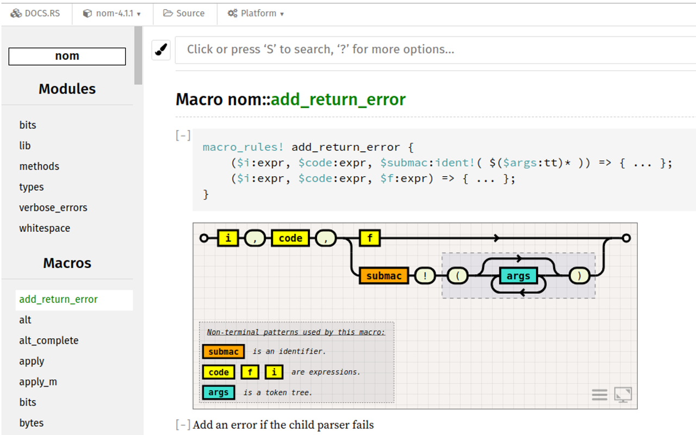

A `WebExtension` compatible with Chrome and Firefox to display syntax-diagrams for Rust's `macro_rules!()` on `docs.rs` and `doc.rust-lang.org`.

**A pre-built version for Chrome is published [here](https://chrome.google.com/webstore/detail/macrorailroad/jeinhnlccpembeoccdhdpnolnmkfcblp), for Firefox [here](https://addons.mozilla.org/en-US/firefox/addon/macro_railroad/)**

The extension uses [macro_railroad](https://github.com/lukaslueg/macro_railroad) to generate diagrams. The diagrams are shown beneath each macro-block. Use the icons in the lower right corner to control options and expand the diagram to fullscreen.

To modify and build the extension locally:

* Install the `cargo-web` binary from `crates.io`
* Use `ext/Makefile` to re-build the Rust-parts. The javascript-shim built by `cargo-web` currently needs a little patching which the Makefile takes care of.
* Go to "about:debugging" (Firefox) or "chrome://extensions" (Chrome) and use "Load temporary Add-on"/"Load local extension" with `manifest.json` to load the extension.
* Having made changes, re-execute `make` to rebuild the Rust-parts, reload the extension.
