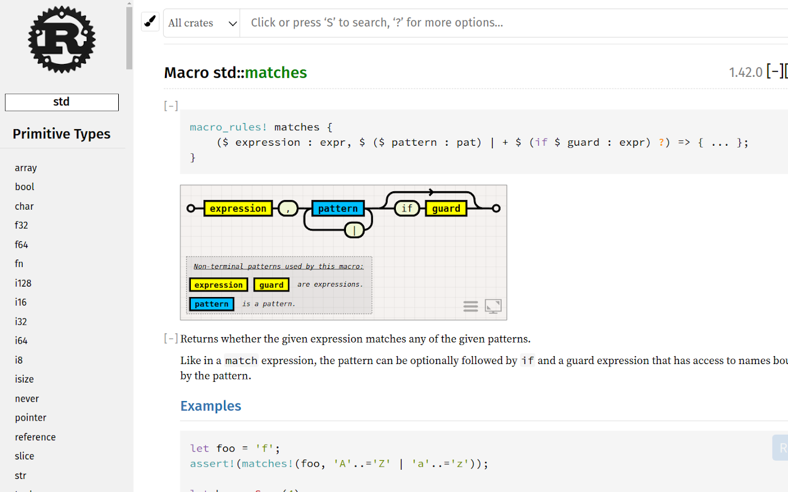

A `WebExtension` compatible with Chrome, Firefox and Edge to display syntax-diagrams for Rust's `macro_rules!()` on `docs.rs`, `doc.rust-lang.org` and all other pages generated by `rustdoc`.

**A pre-built version for Chrome is published [here](https://chrome.google.com/webstore/detail/macrorailroad/jeinhnlccpembeoccdhdpnolnmkfcblp), for Firefox [here](https://addons.mozilla.org/en-US/firefox/addon/macro_railroad/), for Edge [here](https://microsoftedge.microsoft.com/addons/detail/falpndjdhnafmnjajiooahgjlimgjjjk)**.

**`macro_railroad_ext` is also integrated into [`Rust Search Extension`](https://rust.extension.sh/)**

---

The extension uses [macro_railroad](https://github.com/lukaslueg/macro_railroad) to generate diagrams. The diagrams are shown beneath each macro-block. Use the icons in the lower right corner to control options and expand the diagram to fullscreen.

To modify and build the extension locally:

* Install the `wasm-pack` binary from `crates.io`.
* The package in `wasm_src` can be executed via `wasm-pack build -t no-modules` to build destination wasm package, although the `Makefile` usually takes care of that.
* `make test` executes the integration tests; Chrome is required.
* `make screenshots` takes a couple of screenshots on common pages for visual inspection; Chrome is required.
* `make playground` builds the extension from source and starts a blank-profile Chrome with the extension loaded; press ctrl+c to quit.
* `make packed.zip` builds the extension's compressed archive, which can be loaded into a browser as a temporary extension.
* Go to "about:debugging" (Firefox) or "chrome://extensions" (Chrome) and use "Load temporary Add-on"/"Load local extension" with `manifest.json`/`packed.zip` to load the extension.

---

**Note:** The only reason this extension requests access to `file:///*` is local documentation; no data is *ever* transferred. You may need to enable "Allow access to file URLs" in Chromium-based browsers to use the extension with local documentation.
